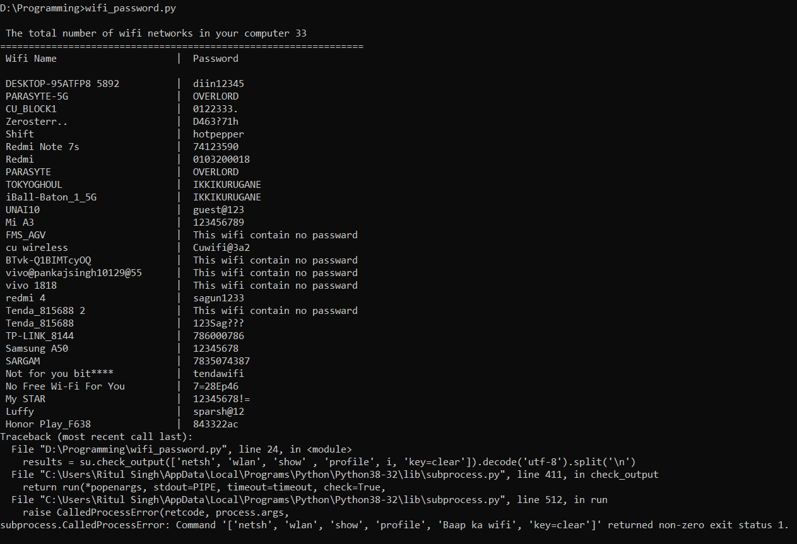
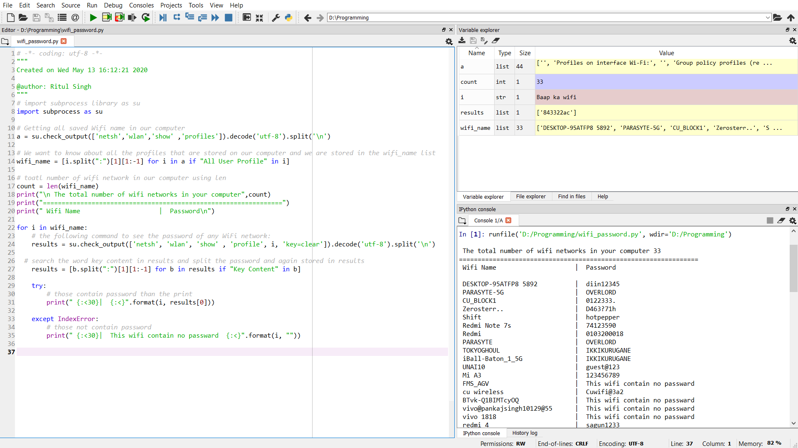

# Wifi-Password-in-Windows
It is anything but difficult to track down a WiFi secret phrase in Windows 10 utilizing this python program. These orders work in any event when you are disconnected, or you are associated with some other WiFi network. At whatever point we associate with a WiFi arrange and enter the secret phrase to interface with that organize, we really make a WLAN profile of that WiFi organize. That profile is put away inside our PC, alongside the other required subtleties of the WiFi profile. Utilizing the python code, we can see the all associated wifi secret key. 

In the event that, you can't recollect the secret phrase of your remote system, one path is to get to the equivalent by means of your switch's settings. But since perusing through switch settings can be a significant undertaking once in a while. Along these lines, rather than utilizing a GUI to locate the individual passwords, we can likewise search for the WiFi secret key of that specific WiFi arrange to utilize CMD and this python code.
## Discover the WiFi Password on Windows Using CMD

Open the order brief in manager mode. Type "cmd" in the Run box, right-click the order brief symbol and pick Run as **Administrator**. Presently open the python code in **CMD** and hit enter to see the WiFi password.

### Discover the WiFi Password on Windows Using Spyder Code Editor 

Open any python code editor than open the python code in the editor and ran the code to see the WiFi password. Here I am using the **Spyder code editor**.

